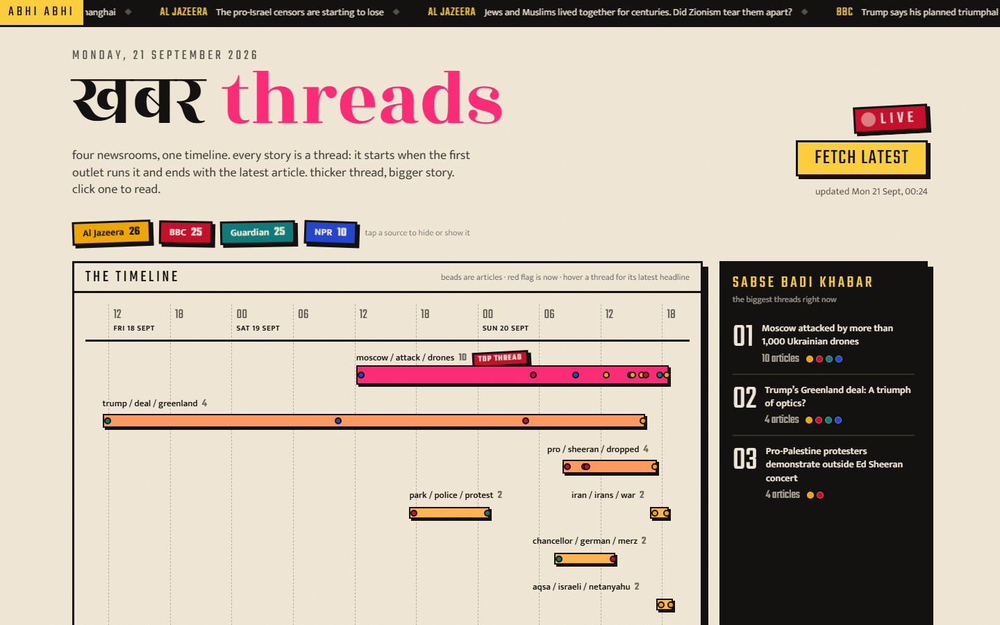

# Khabar Threads

A small system that pulls live articles from four news RSS feeds, groups related articles into
topic clusters, and shows those clusters as a timeline. *Khabar* is Hindi for news; each cluster is
a thread of articles from different outlets about the same story. (The assessment brief calls the
project "News Pulse"; this is my build of it.)

| | |
|---|---|
| Live frontend | https://khabar-threads.vercel.app |
| Live API | https://khabar-threads-api.onrender.com (`GET /` lists the endpoints; free tier, first request after idle takes up to a minute) |
| Repo layout | [`scraper/`](scraper) Python · [`backend/`](backend) Node.js · [`frontend/`](frontend) Next.js |



## Architecture

```
   BBC / NPR / Guardian / Al Jazeera RSS
                  |
                  v
   scraper/  (Python)  fetch feeds -> normalise -> fetch article pages -> store new ones
                       -> group into clusters -> write clusters            [runs inside the API container,
                  |                                                          or on a GitHub Actions cron]
                  v
   Neon Postgres  articles(url UNIQUE, source, title, summary, body, published_at, cluster_id)
                  clusters(id, label)
                  ^
                  |
   backend/  (Node.js, Express)  /clusters  /clusters/:id  /timeline  /ingest/trigger  /ingest/status/:jobId
                  ^
                  |
   frontend/ (Next.js)  timeline of clusters, source filter, cluster detail drawer, Refresh button
```

One Docker image on Render runs the API; when the API receives `POST /ingest/trigger` it spawns the
Python scraper as a child process in the same container. The frontend is a static Next.js build on
Vercel that talks to the API directly from the browser.

## Running it locally

Prerequisites: Node 22.18+ (24 recommended), Python 3.11+, a Postgres URL (a free Neon project works).

```bash
git clone https://github.com/gauravsoodtech/khabar-threads && cd khabar-threads
cp .env.example .env            # fill in DATABASE_URL; the other defaults work locally

# scraper
python -m venv .venv
.venv/Scripts/activate           # Windows   (Linux/macOS: source .venv/bin/activate)
pip install -r scraper/requirements.txt
python -m scraper.run            # pulls the feeds, stores new articles, rebuilds clusters
python -m scraper.test_cluster   # the clustering self-check

# API (no build step: Node runs the .ts files directly)
cd backend && npm install && npm run dev     # http://localhost:3001

# frontend
cd frontend && npm install && npm run dev    # http://localhost:3000
```

The backend reads `.env` from the repo root. The frontend reads `NEXT_PUBLIC_API_URL` from the
environment at build time (create `frontend/.env.local` with that one line for local dev if the API
is not on port 3001).

## Part 1: scraper

**Sources.** BBC World, NPR World, The Guardian World, Al Jazeera (all feeds). Four rather than three
so one outage still leaves three; world desks were chosen because they overlap on big stories, which
is what makes clustering meaningful. The exact URLs are in [`scraper/feeds.py`](scraper/feeds.py).

**Normalising feed differences** ([`feeds.py`](scraper/feeds.py)). All four are RSS 2.0, parsed with
the standard library so the normalisation is visible code rather than a library default:

- summary: `<description>` first, `<content:encoded>` as fallback (NPR uses the latter), HTML stripped;
- date: `<pubDate>` then `<dc:date>`; RFC 822 parsed first, ISO 8601 second, fetch time last; naive
  datetimes are treated as UTC (`-0000` comes back naive from Python's parser);
- URL: query string and fragment dropped, because NPR appends `?utm_medium=RSS` to every link.

**Full article text** ([`fulltext.py`](scraper/fulltext.py)). Each new article's page is fetched with
a 10 s timeout in a thread pool of 8 and the body extracted with trafilatura. Any failure leaves
`body = NULL`; the article is still stored. Only articles whose URL is not already in the database are
fetched, so re-runs cost one page load per genuinely new story.

**Deduplication and re-runs.** `articles.url` is `UNIQUE` and inserts use `ON CONFLICT DO NOTHING`, so
the database enforces "never store the same article twice" rather than application code. The scraper is
safe to run on a schedule; the GitHub Actions workflow in `.github/workflows/ingest.yml` triggers it
every six hours.

**Topic grouping** ([`cluster.py`](scraper/cluster.py)). Keyword overlap (Option A), chosen because it
is explainable in one breath and has no model to tune:

1. Each article's headline plus the first 60 words of its summary becomes a set of meaningful words:
   lowercase, letters only, 3+ characters, stop words removed (`stopwords.txt`).
2. Two articles are linked when they share at least `--min-shared` meaningful words (default 3) **and**
   at least one of those words appears in both headlines.
3. Linked articles are merged into groups (union-find). Groups of two or more become clusters.
4. The cluster label is the three words most of its articles have in common.

Clusters are rebuilt from scratch on every run over the last `--days` (default 3) of articles, inside
one transaction, so cluster ids change between runs but readers never see a half-written state.

**How the thresholds were picked.** `python -m scraper.run --from-feeds --min-shared N` prints every
cluster with its member headlines without touching the database. On 19 Sep 2026 (85 articles):

| `--min-shared` | clusters | largest | what it looked like |
|---|---|---|---|
| 2 | 10 | 13 | the largest cluster chained Greenland, the Asian Games, CNN and Kennedy Center stories through "trump" and "military" |
| 3 | 10 | 6 | coherent, except one chain (Greenland deal, South Korea and Iran, Taiwan) linked by "trump" + "military" |
| 4 | 6 | 3 | every cluster correct, but the Kennedy Center story (3 outlets) and the South Africa story (2) were lost |

Two things the first runs taught me, both now in the code: the Guardian embeds "free daily email, app,
podcast" newsletter boilerplate in its summaries, which linked every Australian story to every other
one until those words joined the stop list; and number words and weekdays ("four killed on Friday")
were supplying the third shared word between unrelated stories. The headline rule in step 2 came from
the same session: two long summaries can share three generic words, two headlines rarely do.

**Limitation I noticed.** Union-find is single-link clustering, so A~B and B~C put A and C in the same
cluster even if they share nothing. A frequent name like a head of state plus one generic word
("military") is enough to chain two unrelated stories. A fix would be to require each article to link
to most of the cluster, not just one member, or to weight words by how many articles they appear in.

## Part 2: API

Express 5 with the `pg` driver, all config from environment variables (`DATABASE_URL`, `PORT`,
`CORS_ORIGIN`, `PYTHON_BIN`). The API applies the same `schema.sql` as the scraper at boot, so it
works cold before the first ingest.

| Endpoint | Returns |
|---|---|
| `GET /` | endpoint index |
| `GET /health` | `{ok: true}` after a `SELECT 1` (Render's health check) |
| `GET /articles?limit=15` | the newest articles across all sources with their `cluster_id`, for the headline ticker; `400` unless `limit` is 1 to 50 |
| `GET /clusters` | `[{id, label, count, start, end, sources}]` ordered by start |
| `GET /clusters/:id` | the cluster with its articles sorted chronologically; `400` if `:id` is not a positive integer, `404` if unknown |
| `GET /timeline` | `{generatedAt, range, sources, clusters: [{id, label, count, start, end, intensity, sources, latest_title, points}]}` |
| `POST /ingest/trigger` | `202 {jobId}`; `409 {jobId}` if a job is already running |
| `GET /ingest/status/:jobId` | `{status: queued, running, done, failed, summary, error, log}`; `400` if not a UUID, `404` if unknown |

Timeline shape: each cluster is a span (`start`, `end`) with a size metric (`intensity` = count divided
by the largest cluster's count) and `points`, the individual article times with their source, so the
frontend can filter by source and redraw spans without another request. Unhandled errors go to one
handler that returns `500 {error}`.

Job state is an in-memory map, which is enough for a single instance; a restart forgets running jobs,
and the frontend treats a `404` while polling as "restarted, reload the data".

## Part 3: frontend

Next.js 16 (App Router, TypeScript, Tailwind v4), one client page, no chart library. The look is an
Indian newsstand: cream paper with a print grain, thick ink borders, stickers set at slight angles, a
black breaking-news ticker, and a masthead set in Rozha One, an Indian Type Foundry face that reads
like a Hindi daily's nameplate (body text in Mukta, numerals in Teko, both Devanagari-aware). Colours
are named after what they are here: haldi, genda, rani, peacock, kumkum.

- **Ticker** ([`Ticker.tsx`](frontend/app/Ticker.tsx)): the newest 15 headlines from `GET /articles`
  scroll across the top like a news channel's breaking bar; hover pauses it, a click opens that
  story's thread (or the article itself if it is not in a thread yet).
- **Timeline** ([`Timeline.tsx`](frontend/app/Timeline.tsx)): a ruler with hour ticks and day labels,
  and one ribbon per thread from its first article to its latest. Ribbons that would overlap go into
  separate lanes, biggest threads on top. Thickness and colour scale with the thread's size (haldi for
  small, rani for the biggest, which also gets a "top thread" sticker), beads on the ribbon are the
  individual articles coloured by source, a red "abhi" flag marks now, and hovering a ribbon shows its
  latest headline and span.
- **Top threads rail** ([`TopThreads.tsx`](frontend/app/TopThreads.tsx)): the three biggest threads
  with their latest headline; click one to open it.
- **Thread detail** ([`Drawer.tsx`](frontend/app/Drawer.tsx)): slides in from the right with every
  article in the thread, oldest first: source, time and "2 h ago", headline linking to the original,
  summary, and whether the full text was pulled.
- **Filter by source**: the source stickers toggle; spans, sizes and lanes are recomputed on the client.
- **Fetch latest**: calls `POST /ingest/trigger`, polls `/ingest/status/:jobId` every 2 s and shows the
  scraper's own last log line while it runs ("feed BBC: 25 items", "stored 12 new articles"), then
  reloads and reports what it found.
- **Live**: the timeline reloads quietly every 60 s while the tab is visible.
- **Cold start**: the API's free tier sleeps when idle; the page says so and retries instead of erroring.
- Motion (ribbons growing in, stickers popping, the ticker) is CSS only and is switched off for users
  who prefer reduced motion.

Cross-source story merging (the third stretch goal) was not attempted.

## Part 4: deployment, what runs where and why

| Component | Where | Why |
|---|---|---|
| Frontend | Vercel | static Next.js build, free, `NEXT_PUBLIC_API_URL` set in the project settings before the build |
| API + scraper | Render free web service, Docker | the brief asks for the pipeline to be triggered by the API, so both live in one image (`node:24-slim` plus `python3` in a venv) and the API spawns `python -m scraper.run`; `render.yaml` is the blueprint |
| Scheduler | GitHub Actions cron, every 6 h | free, visible in the repo, and it exercises the same trigger endpoint the button uses |
| Database | Neon Postgres free tier | hosted Postgres reachable from both Render and a laptop; `UNIQUE` and `ON DELETE SET NULL` do real work here |

Secrets live only in the platforms' environment settings; `.env.example` documents the names.

## Assumptions made where the brief was open

- A story only one outlet ran is not yet a "topic": singletons are stored as articles but not shown
  as clusters.
- Cluster ids are per run. The timeline is rebuilt each ingest, so links to a cluster are not stable
  across refreshes.
- `POST /ingest/trigger` is unauthenticated; the single-job lock is the only guard, which is enough
  for a demo but would need a token in production.
- Times are stored in UTC and shown in the viewer's local timezone.

## Tools

AI coding tools (Claude Code) were used for scaffolding and review; the design decisions, the tuning
and the explanations above are mine.
